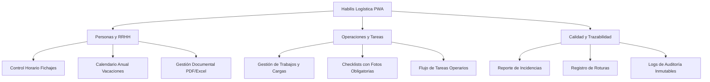

# 🚚 Plataforma de Gestión Logística Habilis
> **Solución Digital Integral PWA para Control Operativo, Calidad y Gestión de Personas**

---

## 📌 Resumen Ejecutivo

**Habilis Logística** es una Aplicación Web Progresiva (PWA) de última generación, diseñada a medida para digitalizar, optimizar y auditar todas las operaciones diarias de la empresa. 

La plataforma unifica la **gestión del personal**, el **control de las operaciones en tiempo real**, y el **aseguramiento de la calidad** en una interfaz intuitiva, rápida y adaptada a cualquier dispositivo (móviles, tablets y ordenadores).

---

## 👥 Roles de Usuario y Experiencia (UX)

La plataforma cuenta con tres paneles de control diferenciados según el perfil del usuario:

### 1. 👷 Panel del Operario (Móvil First)
Diseñado para su uso ágil en el almacén o en ruta desde teléfonos móviles:
*   **Fichaje Inteligente:** Entrada y salida con un solo toque, con contador en tiempo real y cálculo automático de horas.
*   **Gestión de Trabajos:** Visualización de cargas/descargas asignadas con su estado (Pendiente, En Proceso, Completado).
*   **Checklists de Seguridad y Calidad:** Procesos guiados donde es obligatorio adjuntar una fotografía como evidencia para poder finalizar el trabajo.
*   **Comunicación Directa:** Envío rápido de dudas y reporte de incidencias o roturas con foto al instante.

### 2. 👩‍💼 Panel del Responsable / Supervisor (Gestión de Planta)
Herramienta de control en tiempo real para coordinar el día a día:
*   **Estado del Equipo:** Monitoreo visual de qué operarios están activos (fichados), sus horas acumuladas y sus tareas.
*   **Asignación de Operaciones:** Creación y asignación de cargas, descargas y tareas específicas al personal de almacén.
*   **Supervisión de Calidad:** Recepción y gestión en tiempo real de incidencias y roturas reportadas, con visualización de fotos adjuntas.

### 3. 👑 Panel del Administrador (Control Total y RRHH)
Consola central para la toma de decisiones y gestión de recursos:
*   **Gestión Documental y de Personal:** Alta/baja de usuarios, subida de documentos oficiales (nóminas, contratos, formación) organizados por categorías.
*   **Planificación Anual:** Aprobación o denegación de solicitudes de vacaciones en un calendario interactivo que calcula los días restantes.
*   **Exportación de Datos:** Descarga de informes detallados de control horario y de operaciones en formatos **Excel (.xlsx)**, **CSV** y **PDF** listos para auditorías.
*   **Historial de Auditoría (Audit Log):** Registro inmutable de cada acción relevante en el sistema (quién hizo qué y cuándo) para máxima trazabilidad.

---

## 🛠️ Características Tecnológicas Premium

*   **PWA (Progressive Web App):** Instalable en el escritorio del ordenador o como una app nativa en el móvil. Funciona sin problemas gracias al Service Worker integrado.
*   **Modo Offline (Sin Conexión):** Estrategia de caché avanzada que permite a los operarios seguir consultando la aplicación y rellenando checklists incluso en zonas del almacén sin cobertura.
*   **Dualidad de Datos (Demo / Firebase):** 
    *   *Modo Demostración:* Utiliza almacenamiento local (`localStorage`) para que cualquier persona pueda probar todas las funciones inmediatamente sin configurar nada.
    *   *Modo Firebase:* Conexión directa a una base de datos segura y escalable en la nube (Firestore, Firebase Auth y Storage) desactivando el modo demo desde los Ajustes.
*   **Diseño Corporativo Habilis:** Paleta de colores corporativa (Naranja-Rojo `#FF4D3D` y Azul `#00609F`), tipografía moderna, interfaces limpias con efectos de desenfoque (glassmorphism) y animaciones fluidas.

---

## 📊 Beneficios de Negocio

1.  **Cero Papel:** Digitalización completa de nóminas, contratos, fichajes y checklists de operaciones.
2.  **Trazabilidad Total:** Evidencias fotográficas obligatorias en las cargas y descargas que previenen reclamaciones falsas de clientes.
3.  **Cumplimiento Legal:** Registro de jornada de operarios preciso y exportable a PDF en caso de inspecciones de trabajo.
4.  **Reducción de Tiempos:** Comunicación directa de incidencias que acelera su resolución por parte del equipo de calidad.
