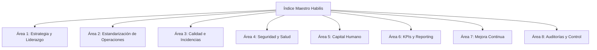

# 🗂️ Índice Maestro de Gestión y Optimización Logística (Habilis - Saica Pack)
> **Sistema Documental Integrado bajo Marcos Lean Logistics, Six Sigma, ISO 9001 (Calidad) e ISO 45001 (Seguridad)**

Este documento constituye la estructura de información de **Habilis** para liderar la operativa de carga y optimización en la planta de **Saica Pack**. El sistema está diseñado bajo el ciclo continuo de mejora **PDCA (Plan-Do-Check-Act)** y la metodología **DMAIC (Define-Measure-Analyze-Improve-Control)** de Six Sigma.

---

## 🗺️ Mapa General de Áreas Documentales

---

## AREA 1: Dirección, Estrategia y Liderazgo (ISO 9001)
*Garantiza el alineamiento estratégico de Habilis con las necesidades de Saica Pack, estableciendo las políticas y la estructura organizativa.*

*   **`M-DIR-001` - Manual General del Sistema de Gestión Logística (MSGL):** Documento paraguas que describe la estructura de Habilis, la política de calidad, la misión del servicio en Saica Pack y el mapa interactivo de procesos.
*   **`PR-DIR-001` - Procedimiento de Revisión por la Dirección:** Define la frecuencia, los participantes y la estructura de las reuniones de revisión periódica del contrato y los KPIs con los representantes de Saica Pack.
*   **`REG-DIR-001` - Registro de Acuerdos de Nivel de Servicio (SLA) y Objetivos Estratégicos:** Registro del contrato marco donde se fijan las metas del proyecto (p. ej. reducción del 15% en tiempos de permanencia, cero accidentes).

---

## AREA 2: Operaciones y Trabajo Estandarizado (Lean Logistics / ISO 9001)
*Orientado a la eliminación del despilfarro (Muda), optimización del flujo físico de mercancías y estandarización de las tareas (Standard Work).*

*   **`PR-OPE-001` - Procedimiento de Gestión de Almacén y Control de Tráfico (Yard Management):** Regula el flujo de camiones desde que llegan a las instalaciones de Saica Pack hasta que se registran, se les asigna muelle y salen.
*   **`SOP-OPE-001` - Procedimiento Estandarizado de Trabajo (SOP) para Descarga y Recepción de Bobinas de Papel (Materias Primas):** Instrucción técnica paso a paso para el uso seguro de pinzas para bobinas, etiquetado y almacenamiento.
*   **`SOP-OPE-002` - SOP para Movimientos Internos y Alimentación a Línea de Onduladoras:** Optimización de recorridos del carretillero para alimentar la línea sin generar tiempos muertos de fabricación.
*   **`SOP-OPE-003` - SOP para la Preparación de Pedidos y Paletización (Picking):** Estándar de conformación de palés de planchas de cartón para evitar caídas y optimizar el espacio.
*   **`SOP-OPE-004` - SOP para Carga y Estiba Segura en Camiones (Producto Terminado):** Método de estiba para maximizar el peso y volumen ocupado de los camiones, asegurando el trincado de la carga.
*   **`SOP-OPE-005` - SOP de Limpieza y Orden en Almacenes mediante Metodología 5S:** Implementación sistemática de las 5S (Clasificar, Ordenar, Limpiar, Estandarizar, Disciplinar) en las zonas logísticas de Habilis.

---

## AREA 3: Calidad, Trazabilidad e Incidencias (ISO 9001)
*Asegura el control analítico de las desviaciones y protege la mercancía de Saica Pack durante la manipulación logística.*

*   **`PR-CAL-001` - Procedimiento de Control de Producto No Conforme y Devoluciones:** Proceso a seguir cuando se detecta material defectuoso antes de cargarlo en los camiones.
*   **`PR-CAL-002` - Procedimiento de Gestión de Incidencias, Daños y Roturas:** Tratamiento rápido ante una rotura física del cartón: aislamiento, valoración económica y registro del motivo.
*   **`PR-CAL-003` - Procedimiento de Acciones Correctivas y Preventivas (CAPA):** Análisis mediante "Los 5 Porqués" o diagrama de Ishikawa cuando un KPI se desvía del objetivo.
*   **`SOP-CAL-001` - Protocolo de Captura de Evidencias Fotográficas Digitales:** Instructivo para el uso del módulo de fotos en la PWA (qué ángulos fotografiar, luz correcta y obligatoriedad por carga).
*   **`REG-CAL-001` - Registro Histórico de Roturas, Mermas y Costes Asociados:** Base de datos para analizar las causas y coste de las roturas por turno, operario y muelle.
*   **`REG-CAL-002` - Registro de Acciones Correctivas y Preventivas Abiertas/Cerradas.**

---

## AREA 4: Seguridad, Salud y Prevención (ISO 45001 - Objetivo Accidentes Cero)
*Enfoque proactivo para mitigar riesgos inherentes a las operaciones con carretillas y cargas pesadas.*

*   **`PR-SST-001` - Manual de Seguridad en Operaciones Logísticas de Almacén:** Reglas de seguridad aplicables al personal, incluyendo velocidades de carretillas, giros ciegos y zonas peatonales.
*   **`PR-SST-002` - Procedimiento de Coordinación de Actividades Empresariales (CAE) con Saica Pack:** Define los canales de información compartida de seguridad por operar bajo el mismo techo.
*   **`PR-SST-003` - Procedimiento de Registro y Análisis de Incidentes Sin Daños ("Near-Misses"):** Notificación de situaciones peligrosas de carretillas que casi acaban en accidente, permitiendo actuar antes de que ocurran.
*   **`SOP-SST-001` - SOP de Uso Seguro de Carretillas Elevadoras con Implementos:** Normas de uso seguro de horquillas y pinzas de bobinas.
*   **`REG-SST-001` - Checklist Diario de Seguridad Pre-Uso de Maquinaria:** Formulario digital de comprobación de frenos, luces, dirección y estado del mástil de cada carretilla.
*   **`REG-SST-002` - Registro de Entrega y Control de Equipos de Protección Individual (EPIs).**

---

## AREA 5: Recursos Humanos, Competencias y Formación (ISO 9001 / ISO 45001)
*Garantiza que la plantilla de Habilis esté perfectamente capacitada y polivalente para la operativa específica de Saica Pack.*

*   **`PR-RRHH-001` - Procedimiento de Acogida, Onboarding y Capacitación Logística:** Plan de entrenamiento del primer día para nuevos operarios.
*   **`PR-RRHH-002` - Procedimiento de Evaluación del Desempeño y Productividad Individual:** Evaluación sistemática para detectar necesidades de formación (y no para castigo del empleado).
*   **`REG-RRHH-001` - Matriz de Polivalencia del Personal (Skills Matrix):** Cuadrante visual en el que se muestra el nivel de habilidad de cada operario en los diferentes SOPs (Descarga, Alimentación, Carga, etc.).
*   **`REG-RRHH-002` - Plan Anual de Capacitación y Fichas de Formación Firmadas.**
*   **`REG-RRHH-003` - Ficha Individual de Aptitud Médica, Autorización de Maquinaria y Firmas de Normas.**

---

## AREA 6: Medición mediante KPIs y Reporting (Data-Driven)
*Estructura matemática del proyecto. Define cómo medir para poder mejorar de forma cuantitativa.*

*   **`PR-KPI-001` - Procedimiento de Cálculo e Definición de Métricas Logísticas:** Fórmulas matemáticas, fuentes de datos y frecuencias de medición para cada indicador:
    *   *Tiempos de Carga (Medias totales, por palé, por tonelada y por m³).*
    *   *Fases de Permanencia del Camión (Espera, Registro, Muelle, Carga y Salida).*
    *   *Productividad del Personal (Palés/hora, Movimientos/hora).*
    *   *Índice de Rotura (Mermas / coste).*
    *   *Cumplimiento de Horarios (OTD - On-Time Delivery).*
    *   *Aprovechamiento del Camión (% volumen y peso ocupado).*
*   **`PL-KPI-001` - Plantilla de Recogida de Tiempos de Carga e Incidencias (Datos de campo).**
*   **`PL-KPI-002` - Plantilla de Tiempos de Control de Permanencia del Camión (Logística externa).**
*   **`REP-KPI-001` - Plantilla de Informe Diario de Operación (Daily Control Sheet).**
*   **`REP-KPI-002` - Plantilla de Informe Semanal y Mensual de Resultados (Report de Gestión).**
*   **`REP-KPI-003` - Cuadro de Mando Visual Integrado (Dashboard de KPIs) para Saica Pack.**

---

## AREA 7: Gestión de Mejora Continua y Comparación (Lean / Six Sigma)
*Metodología para el control y aprobación de las mejoras, comparando de forma objetiva la situación previa y la posterior.*

*   **`PR-MC-001` - Procedimiento de Gestión del Cambio Operativo y Estandarización:** Protocolo para probar y validar un nuevo método antes de implantarlo definitivamente.
*   **`PL-MC-001` - Plantilla de Resolución de Problemas A3 Lean:** Estructura en 8 pasos (Basado en el método Toyota) para resolver desvíos de KPIs logísticos.
*   **`PL-MC-002` - Formulario Técnico de Comparación de Procedimientos (Antes vs. Después):** Hoja comparativa donde se prueban los mismos KPIs en dos periodos equivalentes y bajo dos metodologías de trabajo distintas.
*   **`REG-MC-001` - Registro Maestro de Mejoras Implantadas e Histórico de Retornos Financieros (ROI):** Registro de las mejoras consolidadas, los KPIs beneficiados y el ahorro de costes asociado.
*   **`REG-MC-002` - Registro de Propuestas e Ideas de Mejora (Buzón Kaizen de los Operarios).**

---

## AREA 8: Auditorías y Sostenibilidad del Sistema
*Garantiza que los procedimientos implantados se sigan en el tiempo y no se degrade la operativa.*

*   **`PR-AUD-001` - Procedimiento de Auditorías Internas del Servicio Logístico:** Calendario y protocolo de inspecciones internas de Habilis.
*   **`SOP-AUD-001` - Protocolo de Auditorías de Trabajo Estandarizado (Gemba Walks):** Guía para que el Responsable de Operativas audite periódicamente en el propio muelle si los operarios siguen los SOPs activos.
*   **`REG-AUD-001` - Checklist Semanal de Auditoría de 5S en Almacenes.**
*   **`REG-AUD-002` - Informe de Hallazgos, No Conformidades y Planes de Acción de Auditoría.**
